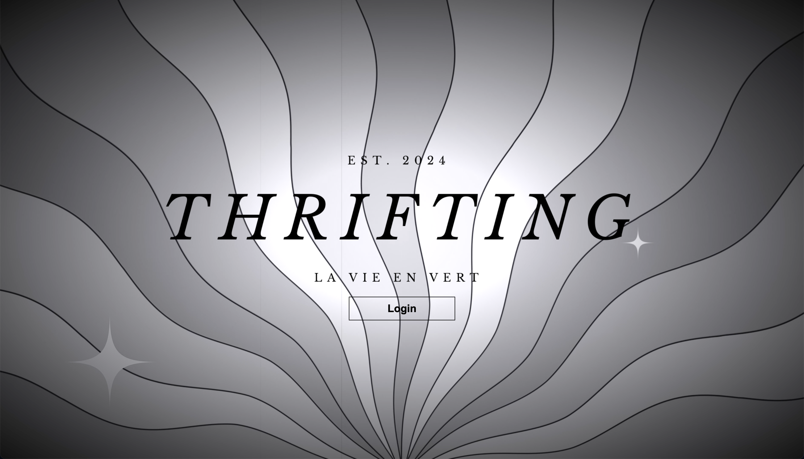

 <div align="center">


# Thrifting.com


[](https://opensource.org/licenses/MIT)
[](https://developer.mozilla.org/en-US/docs/Web/HTML)
[](https://developer.mozilla.org/en-US/docs/Web/CSS)
[](https://developer.mozilla.org/en-US/docs/Web/JavaScript)


[](https://react-redux.js.org/)

[](https://nodejs.org/en/)


[](https://www.mongodb.com/)
[](https://www.mongodb.com/cloud/atlas)


## Introduction
Welcome to `Thrifting.com`, the ultimate destination for vintage fashion enthusiasts and thrift lovers! Our website is a treasure trove of unique, hand-picked vintage clothing and accessories, perfect for those who love to stand out with their style. We are dedicated to providing an eco-friendly shopping experience that not only helps you find rare fashion gems but also promotes sustainable practices.

</div>

## Table of Contents
1. [Introduction](#introduction)
2. [Deploy](#deploy)
3. [What We Offer](#what-we-offer)
4. [Features](#features)
5. [Installation](#installation)
6. [Usage](#usage)
7. [Sustainability Commitment](#sustainability-commitment)
8. [Contact Us](#contact-us)

## Deploy
The application is deployed on Render and can be accessed [here](https://thrifting.onrender.com/).

[](https://thrifting.onrender.com/)

 

## What We Offer
- **Curated Vintage Collections:** Explore a wide range of vintage clothing and accessories from various eras. Each item is carefully selected for its quality, uniqueness, and style.
- **Eco-Friendly Fashion:** Embrace sustainable fashion choices with pre-loved items that reduce waste and environmental impact.
- **Style Inspiration:** Get inspired by our lookbooks and style guides that help you incorporate vintage pieces into modern wardrobes.
- **Community Engagement:** Join our community of thrift enthusiasts, share your finds, and get style tips from fellow vintage lovers.

## Features
- **Easy Navigation:** Our user-friendly interface allows you to quickly find what you're looking for, whether it's by era, style, or size.
- **Secure Payment System:** Shop with confidence using our secure and hassle-free payment process.
- **Regular Updates:** New items are added regularly, so there's always something fresh and exciting to discover.
- **Customer Support:** Our dedicated team is always ready to assist you with any queries or concerns.

## Installation
To get started, clone the repository and install dependencies.
``` 
git clone https://github.com/lundj227/thrifting.com.git
```
```
cd thifting.com
```
```
npm install
```
## Usage

Run the application in Development locally:
```
npm run developer
```

## Sustainability Commitment
At Thrifting.com, we are committed to reducing the environmental impact of fashion. By choosing vintage, you are not only getting a piece of history but also contributing to a more sustainable future.

## Contact Us

Special thanks to the following contributors who have helped make this project possible:

<div style="display: flex; justify-content: flex-start; align-items: center; flex-wrap: wrap;">
  <div style="text-align: center; margin: 0 15px;">
    <a href="https://github.com/JohnHazukaJr">
      
    </a>
    <br>
    <a href="https://github.com/JohnHazukaJr">JohnHazukaJr</a>
  </div>

  <div style="text-align: center; margin: 0 15px;">
    <a href="https://github.com/Trevis-Williams">
      
    </a>
    <br>
    <a href="https://github.com/Trevis-Williams">Trevis-Williams</a>
  </div>

  <div style="text-align: center; margin: 0 15px;">
    <a href="https://github.com/lundj227">
      
    </a>
    <br>
    <a href="https://github.com/lundj227">lundj227</a>
  </div>

  <div style="text-align: center; margin: 0 15px;">
    <a href="https://github.com/marcusperdue">
      
    </a>
    <br>
    <a href="https://github.com/marcusperdue">marcusperdue</a>
  </div>
</div>

---

Thank you for choosing Thrifting.com. Happy thrifting!

 